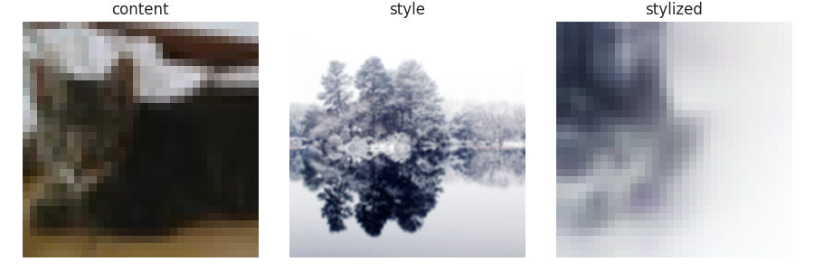

# Visual analytics assignment 4
This repository is assignment 4 out of 4, to be sumbitted for the exam of the university course [Visual Analytics](https://kursuskatalog.au.dk/en/course/115695/Visual-Analytics) at Aarhus Univeristy.

The task of this assignment is defined by the student. The following section describes the goal of the assignment. The __Solution__ section describes how the repository achieves the goal.

## Investigating image style transfer as an image data augmentation method
As an alternative to collecting more data, one can modify the data already in possession to simulate more. This method is referred to as image data augmentation. Typical image augmentations include flipping, either vertically or horizontally, rotation, shifting and whitening. This assignment seeks to investigate whether image style transfer, i.e., the technique of taking the style of one image and applying it to the contents of another, may be used as an image augmentation method besides the classical methods. 

This investigation involves comparing three models: One that takes non-augmented images as input, a model that takes images augmented by classical methods, and a third model that takes non-augmented along with stylized images as input. All models consist of a neural network build on top of the convolutional layers of VGG16. [Zheng et al. (2019)](https://arxiv.org/abs/1909.01056) made a highly similar investigation. They found that for almost all style images, using them for image augmentation increased model performance compared to no-augmentation and classical augmentation models. This assignment is a downscaled version of their study and differs in the following major ways:
- While Zheng et al. used several style transfer models each trained for one particular style, this assignment makes use of _Magenta_ - a fast style transfer model for arbitratry styles ([Ghiasi et al., 2017](https://arxiv.org/abs/1705.06830)) available from [Tensorflow Hub](https://www.tensorflow.org/hub/tutorials/tf2_arbitrary_image_stylization).
- This assignment trains the models on a binary classification task. Two different datasets are utilized: A subset of CIFAR-10 and another dataset available [here](https://www.kaggle.com/datasets/d4rklucif3r/cat-and-dogs). The classsification task itself is of minor relevance. Here, the task is classifying _cat_ versus _dog_.
- Zheng et al. used flipping and rotation as classical augmentation methods. Here, horizontal flipping and shifting up to 20% both horizontally and vertically are used.

## Solution
All code written for this assignment is within ``src``. Here follows a description of the functionality of all the scripts in the folder.

- __utils.py__: A collection of functions used in the other scripts.

- __classify_cifar.py__: Dowloads the Cifar-10 dataset, trains a model and saves it along with accuracy and loss curves for training and validation in the ``models``-folder. A ``txt`` classification report is saved in ``out``. The model input is determined by the user by setting arguments from the terminal. Simply running ``python3 classify_cifar.py`` trains the model on non-augmented images. Adding ``--flip_shift`` performs classical augmentation using the ImageDataGenerator() class from Keras and flow(), while ``--style image.png`` augments the data through style transfer using the style of ``image.png`` and adds it to the original non-augmented data. An example of a stylized image for each class is saved in ``out``. 

Note, this means that the two models taking augmented images as input, train on different data sizes. In the classic augmentation condition, for each epoch, the model sees the same amount of data as the size of the original dataset. However in each epoch, the data will be augmented differently. In the style transfer condition, the dataset is twice the size of the original dataset (there is one stylized version of each original image). This imbalance is inevitable if one is to follow the standard workflow of training on classifcally augmented image data (i.e., using an image data generator and a flow method). There is not an obvious way in which this workflow can be applied to the case of style transfer augmentation. To acommodate the fact that twice as much data was seen in each epoch in the style transer condition, batch sizes were adjusted so that weights were updated an equal number of times for each model training.

- __classify_data.py__: Identical to above, but trains on the data collected from kaggle.

## Results
Running the model on the cifar-10 dataset for each condition results in following accuracies. No augmentation method managed to improve the model compared to training on the original data only. CONSIDER CURVES.

|Augmentation|Overall accuracy|
|---|---|
|None|0.63|
|Flip-shift|0.63|
|Style transfer|0.62|

Looking at the example of a stylized image below, we see that the style transfer is not that successful for Cifar-10 images, since they are quite small (32x32), making it difficult to recognize the contents of the image.



Therefore, the pipeline is repeated for the other dataset containing larger images. The accuracies are seen in the table below.

|Augmentation|Overall accuracy|
|---|---|
|None|0.64|
|Flip-shift|0.63|
|Style transfer|0.62|

GENERALLY LOW ACCURACIES. this repo is not a finished test but allows for testing.

## Setup
Dowload the data from kaggle and place it in ``in``. Remember to unzip the downloaded folder and do not change the organization of the unzipped folder. Place any style image within the folder ``styles``. The folder already contains ``snow.png``. It does not need to be a ``.png``-file.

The scripts require the following to be run from the terminal:

```shell
bash setup.sh
```

This will create a virtual environment, ```assignment4_env``` (git ignored), to which the packages listed in ```requirements.txt``` will be downloaded. __Note__, ```setup.sh``` works only on computers running POSIX. Remember to activate the environment running the following line in a terminal before changing the working directory to ```src``` and running the scripts.

```shell 
source ./assignment4_env/bin/activate
```